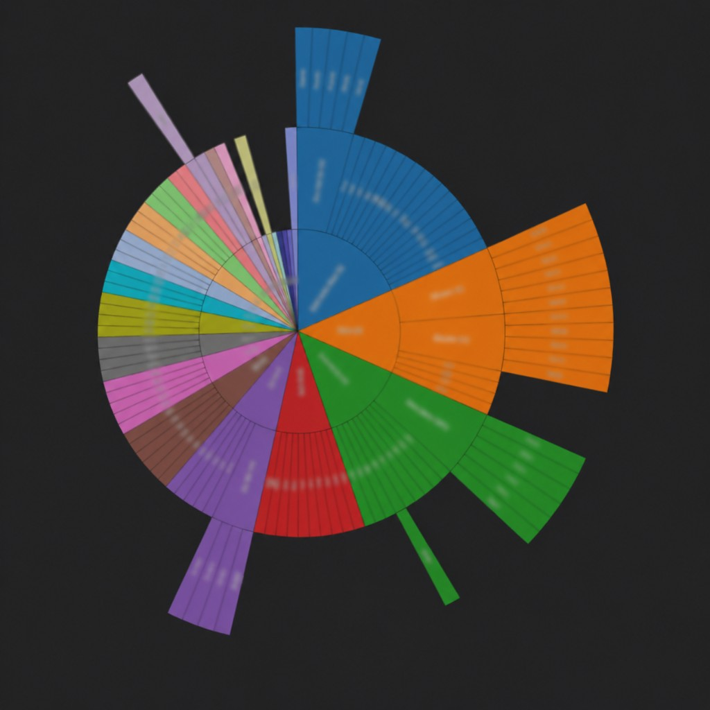
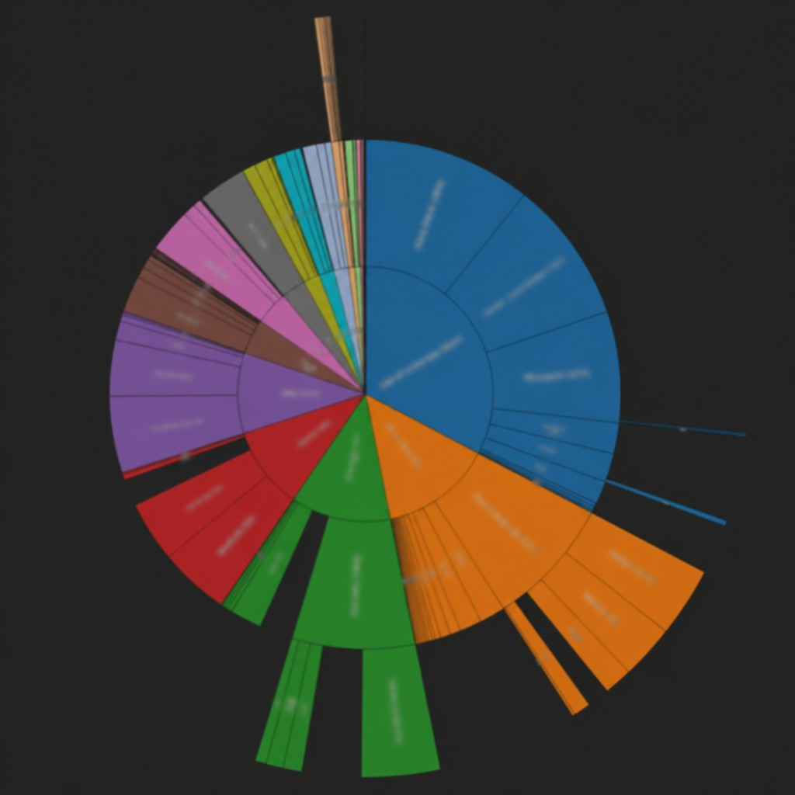

# CategoryManager — plugin GLPI

Visualiseur des **catégories ITIL** (Sunburst, métriques, comptages tickets) dans l’interface GLPI. La version publiée dans **Configuration → Plugins** est définie dans [`setup.php`](setup.php) (`PLUGIN_CATEGORYMANAGER_VERSION`).

## Prérequis

- **GLPI** 11.x (bornes min/max : [`plugin_version_categorymanager()`](setup.php) dans `setup.php`).
- **PHP** ≥ 8.2 (idem `requirements` dans `setup.php`).

## Installation côté GLPI

1. Déposer le dossier du plugin sous `plugins/categorymanager/` (comme tout plugin GLPI).
2. Vérifier que les **fichiers du build** sont présents dans [`public/`](public/) (`index.html`, dossier `assets/`). Sans eux, la page du visualiseur affiche un message invitant à lancer le build.
3. Dans GLPI : **Configuration → Plugins** → installer / activer **CategoryManager**.
4. Menu utilisateur : **Outils → Visualiseur catégories** (libellé selon la langue).
5. **Droits** : **Configuration → Profils** → onglet **CategoryManager** → **Lecture** (`plugin_categorymanager`). Détails dans [`frontend/README.md`](frontend/README.md) (section plugin GLPI).

La page principale utilise **`Html::header` / `footer`** et un template **Twig** (`templates/visualizer_page.html.twig`) pour l’en-tête de page façon GLPI (cartes, icônes Tabler) ; le build **Vue** reste chargé dans ce cadre lorsque `public/` est présent.

## Exemple — vue Sunburst : Structure et Tickets

Sur l’onglet **Sunburst**, la ligne **Affichage** permet de basculer entre deux lectures du même graphe circulaire :

| Mode | Ce que représente le disque |
|------|------------------------------|
| **Structure** | Hiérarchie uniquement : les angles des secteurs suivent la répartition « branches / feuilles » dans l’arbre GLPI, **sans** pondération par volume de tickets. Utile pour visualiser la forme de l’organisation des catégories. |
| **Tickets** | Les surfaces des secteurs sont **proportionnelles au nombre de tickets ouverts par branche** (catégorie + sous-catégories), comme la colonne « Total branche » du tableau. Une branche avec beaucoup de tickets occupe une part angulaire plus grande. |

**Exemple fictif :** trois racines métier *Infrastructure*, *Applications* et *RH*. En mode **Tickets**, si *Infrastructure* concentre 70 % des tickets ouverts sur son arbre et *RH* très peu, le secteur *Infrastructure* domine visuellement le Sunburst. En mode **Structure**, avec les mêmes données ticket, les parts angulaires reflètent surtout la **profondeur et la ramification** de chaque sous-arbre (nombre de niveaux et de feuilles), pas le volume de tickets.

Lorsque **Tickets** est actif, vous pouvez en plus choisir une **période** (filtre sur la date d’ouverture du ticket) ; ce choix **ne s’applique pas** au tableau ni à l’arbre (historique complet), comme rappelé sous les pastilles de période dans l’interface.

### Captures d’écran (exemple)



*Mode **Structure** : angles des secteurs selon l’arbre des catégories (profondeur / ramification), sans pondération par nombre de tickets.*



*Mode **Tickets** : surfaces des secteurs proportionnelles aux tickets ouverts par branche (catégorie + sous-arborescence).*

Les fichiers sources des captures sont versionnés sous [`docs/images/`](docs/images/).

## Langues (français / anglais)

Les libellés **PHP / Twig** passent par gettext (domaine `categorymanager`). Les chaînes du **bundle Vue** sont injectées dans `window.__CM_I18N__` depuis [`inc/i18n_js.class.php`](inc/i18n_js.class.php), selon la langue GLPI (`Session::getLanguage()`).

- **Catalogues** : [`locales/fr_FR.po`](locales/fr_FR.po), [`locales/en_GB.po`](locales/en_GB.po) → fichiers binaires `.mo` compilés au même endroit.
- **Regénérer les `.po` / `.mo`** après modification des msgid dans le PHP ou des traductions dans le script :

```bash
cd plugins/categorymanager   # racine du plugin
python3 scripts/build_locales.py
```

(`msgfmt` doit être installé.) Pour ajouter une nouvelle chaîne côté JS : ajouter une entrée dans `PluginCategorymanagerI18n::getJsMessages()`, puis compléter les dictionnaires du script [`scripts/build_locales.py`](scripts/build_locales.py) et relancer la commande ci-dessus.

## Reconstruire l’interface (assets Vue)

Les sources de l’interface sont dans [`frontend/`](frontend/). Pour régénérer `public/` :

```bash
cd frontend
npm ci    # ou npm install
npm run build
```

Le build Vite écrit directement dans `plugins/categorymanager/public/` (voir [`frontend/vite.config.js`](frontend/vite.config.js)).

**Sur le serveur GLPI**, Node.js n’est nécessaire que si vous compilez **sur cette machine**. Sinon, compilez ailleurs (CI, poste dev) et déployez le dossier `public/` avec le plugin.

## Documentation détaillée

| Document | Contenu |
|----------|---------|
| [`frontend/README.md`](frontend/README.md) | Deux modes (dev avec FastAPI vs plugin GLPI `ajax/native.php`), variables d’environnement, architecture |
| [`docs/STACK_ET_PROFESSIONNALISATION.md`](docs/STACK_ET_PROFESSIONNALISATION.md) | Stack technique, pistes de qualité (lint, tests, CI) |
| [`docs/PRD  CategorieManager - Visualiseur.md`](<docs/PRD  CategorieManager - Visualiseur.md>) | Exigences fonctionnelles (PRD) |
| [`docs/images/`](docs/images/) | Captures d’écran pour la documentation (Sunburst Structure / Tickets) |

## Arborescence utile (aperçu)

```
categorymanager/
├── setup.php, hook.php      # Point d’entrée GLPI, installation / droits
├── inc/                     # Classes PHP (visualiseur, profil, données natives)
├── templates/               # Twig (@categorymanager/…) — enveloppe « corporate » du visualiseur
├── front/visualizer.php     # Page : header/footer GLPI + rendu Twig + bundle Vue si présent
├── ajax/native.php          # JSON en session GLPI (pas de jetons REST navigateur)
├── public/                  # Build de production (généré par npm run build)
├── frontend/                # Sources Vue + serveur FastAPI de développement
└── docs/                    # PRD, stack, références API, images README (docs/images/)
```

## Licence

GPLv3+ (voir métadonnées du plugin dans `setup.php`).
